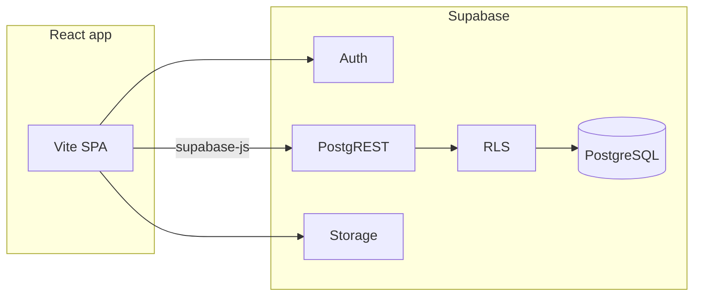

# WorkVault — Supabase backend plan (PostgREST-only, no RPC)

This document replaces the **Express + `better-sqlite3`** stack with **Supabase Auth**, **PostgreSQL**, and the **PostgREST API** (Supabase JS `.from()`, `.select()`, nested resources). **Database RPCs are not used.** The **AI profile enhancement (Gemini)** feature is **out of scope** and should be removed from the app (no Edge Function replacement required).

---

## 1. Current project snapshot

| Layer | Technology |
|--------|------------|
| UI | React 19, Vite 6, TypeScript, Tailwind |
| Server (legacy) | `server.ts` — Express + Vite; SQLite via `better-sqlite3` (removed in Supabase-only setup) |
| API today | Ad-hoc Express routes under `/api/*` |

**SQLite concepts:** `users`, `freelancer_profiles`, `client_profiles`, `portfolio_items`, `projects`, `clients_list`.

**Frontend calls to replace:** register/login/logout, me, profile, avatar upload/delete, freelancers list/detail, projects, clients. **Do not port** `/api/ai/enhance-profile`.

---

## 2. Target architecture (PostgREST)



- **CRUD:** `supabase.from('table_name')` → PostgREST → Postgres (RLS enforced).
- **Joined reads:** nested `.select('*, freelancer_profiles(*), portfolio_items(*)')` only (no `.rpc()`).
- **Auth:** `signUp` / `signInWithPassword` / `signOut`; JWT attached by the client.

---

## 3. Step-by-step: complete the backend

Follow these steps in order. Check off each before moving on.

### Step 1 — Supabase project

1. Create a project at [supabase.com](https://supabase.com).
2. Note **Project URL** and **anon public key** (Settings → API).
3. Under **Authentication → Providers**, enable **Email** (adjust “Confirm email” to match whether you want email verification before login).

### Step 2 — Apply database schema

1. Open **SQL Editor** in the dashboard (or use Supabase CLI migrations if you prefer versioned files).
2. Run **§4 then §5** below: extensions/enums → tables → triggers → `handle_new_user` → RLS enable → `is_freelancer` helper → policies.
3. Confirm tables appear under **Table Editor** (`profiles`, `freelancer_profiles`, `client_profiles`, `portfolio_items`, `projects`, `clients_list`).

### Step 3 — Confirm signup trigger

1. Use **Authentication → Add user** (or a one-off test from the app in Step 7) with metadata `name` and `role` (`freelancer` or `client`).
2. Verify a row appears in `profiles` and the matching child profile table. If not, fix `handle_new_user` and the Auth “raw user meta data” keys.

### Step 4 — Storage for avatars

1. **Storage → New bucket** → name `avatars` (suggest **public** if you want simple `getPublicUrl`, or private + signed URLs).
2. Add policies so **authenticated** users can upload/update/delete only under a folder named with their user id, e.g. `avatars/{user_id}/...` (use Supabase policy templates or SQL in docs).
3. You will update `profiles.avatar_url` via PostgREST after a successful upload.

### Step 5 — Local app environment

1. In the Vite app root, add `.env.local` (and add `.env.local` to `.gitignore` if needed):

   `VITE_SUPABASE_URL=...`  
   `VITE_SUPABASE_ANON_KEY=...`

2. Install the client: `npm install @supabase/supabase-js`.
3. Add `src/lib/supabase.ts` exporting `createClient(VITE_SUPABASE_URL, VITE_SUPABASE_ANON_KEY)`.

### Step 6 — Map old API to PostgREST (reference)

| Old route | New approach |
|-----------|----------------|
| `POST /api/register` | `supabase.auth.signUp({ email, password, options: { data: { name, role } } })` |
| `POST /api/login` | `supabase.auth.signInWithPassword({ email, password })` |
| `POST /api/logout` | `supabase.auth.signOut()` |
| `GET /api/me` | `getUser()` / `getSession()` then `.from('profiles').select('*, freelancer_profiles(*), client_profiles(*)').eq('id', user.id).single()` |
| `POST /api/profile` | `.from('profiles').update({ name })` + `.from('freelancer_profiles' \| 'client_profiles').update({...}).eq('user_id', user.id)` |
| `GET /api/freelancers` | `.from('profiles').select('id, name, role, avatar_url, freelancer_profiles(*)').eq('role', 'freelancer')` (RLS must allow this; see §5.2) |
| `GET /api/freelancers/:id` | Same nested `select`, add `.eq('id', id).single()`, include `portfolio_items(*)` if the FK from `portfolio_items.freelancer_id` → `profiles.id` is exposed in PostgREST (add FK in §4 if needed). |
| `GET/POST /api/projects` | `.from('projects').select()` / `.insert()` — RLS restricts rows |
| `GET/POST /api/clients` | `.from('clients_list').select()` / `.insert()` |
| Avatar upload | `storage.from('avatars').upload(...)` then `profiles.update({ avatar_url })` |
| AI enhance | **Remove** UI entry points and delete or stub `src/lib/ai.ts` |

**PostgREST nested `portfolio_items`:** ensure a foreign key `portfolio_items.freelancer_id → profiles(id)` exists (already in §4). Then:

```ts
.from('profiles')
.select(`id, name, role, avatar_url, freelancer_profiles (*), portfolio_items (*)`)
.eq('id', freelancerId)
.eq('role', 'freelancer')
.single();
```

### Step 7 — Implement auth and session in the UI

1. Replace `AuthPage` `fetch('/api/register' | '/api/login')` with Supabase auth calls.
2. On success, load the full profile row (Step 6 “me” query) into React state.
3. Use `onAuthStateChange` to refresh session on tab focus / token refresh and to clear state on sign-out.
4. Replace `fetch('/api/logout')` with `signOut()`.

### Step 8 — Implement data loading and mutations

1. Replace `fetch('/api/me')`, `/api/projects`, `/api/clients` in `App.tsx` (and anywhere else) with Supabase queries.
2. Replace profile save and avatar upload/delete with Storage + table updates.
3. Replace freelancers explorer data: prefer loading from Supabase instead of only `INITIAL_FREELANCERS`, or merge API results with placeholders until data exists.
4. Remove any call to `enhanceProfileWithAI` / `/api/ai/enhance-profile` and remove related UI (e.g. “Enhance with AI” buttons).

### Step 9 — IDs and types

1. Change domain IDs from `number` to `string` (UUID) in `src/types.ts` and all comparisons (`user.id === x`).
2. Fix any demo data (`INITIAL_FREELANCERS`) to use string ids or stop using numeric ids in comparisons.

### Step 10 — Dev and production serving

1. **Development:** run **`vite` only** (e.g. `npm run dev` pointing at `vite` without `server.ts`), so the browser calls Supabase directly.  
2. **Production:** build static assets (`vite build`) and host on any static host; set the same `VITE_*` env vars at build time.
3. Remove **`server.ts`** and run Vite directly (Supabase-only frontend architecture).

### Step 11 — Cleanup `package.json`

1. Remove dependencies you no longer use: `better-sqlite3`, `multer`, `@google/genai`, `express` (if fully removed), `dotenv` (if unused), etc.
2. Point `dev` script at Vite; add `preview` for static preview if useful.

### Step 12 — Smoke tests

1. Register freelancer → profile + `freelancer_profiles` row → explore list shows them.
2. Register client → `client_profiles` row → cannot see other clients’ private data.
3. Create project as each role → visible only to participants.
4. CRM `clients_list` visible only to owning freelancer.
5. Avatar upload updates `avatar_url` and image loads.
6. Sign out → no access to protected queries.

---

## 4. SQL schema (run in Supabase SQL editor or migrations)

Design goals:

- **`auth.users`** owns identity; **`public.profiles`** holds app fields. **No password column** in `public`.
- **No `email` on `public.profiles`:** use `user.email` from Auth in the client.
- **UUID** primary keys in `public`.
- **`jsonb`** for `skills` and `experience`.

### 4.1 Extensions and enums

```sql
create extension if not exists "pgcrypto";

create type public.user_role as enum ('freelancer', 'client', 'admin');

create type public.project_status as enum (
  'pending',
  'in_progress',
  'completed',
  'overdue',
  'on_hold',
  'canceled'
);
```

### 4.2 Core profile tables

```sql
create table public.profiles (
  id uuid primary key references auth.users (id) on delete cascade,
  name text not null default '',
  role public.user_role not null default 'freelancer',
  avatar_url text,
  created_at timestamptz not null default now(),
  updated_at timestamptz not null default now()
);

create table public.freelancer_profiles (
  user_id uuid primary key references public.profiles (id) on delete cascade,
  bio text not null default '',
  skills jsonb not null default '[]'::jsonb,
  experience jsonb not null default '[]'::jsonb,
  location text not null default '',
  hourly_rate integer not null default 0 check (hourly_rate >= 0),
  designation text,
  tagline text,
  years_exp text,
  projects_count text,
  rating_status text,
  created_at timestamptz not null default now(),
  updated_at timestamptz not null default now()
);

create table public.client_profiles (
  user_id uuid primary key references public.profiles (id) on delete cascade,
  bio text not null default '',
  location text not null default '',
  designation text,
  total_investment text,
  projects_posted text,
  network_rating text,
  created_at timestamptz not null default now(),
  updated_at timestamptz not null default now()
);
```

### 4.3 Portfolio, projects, CRM

```sql
create table public.portfolio_items (
  id uuid primary key default gen_random_uuid(),
  freelancer_id uuid not null references public.profiles (id) on delete cascade,
  title text not null,
  description text not null default '',
  image_url text not null,
  link text,
  sort_order integer not null default 0,
  created_at timestamptz not null default now(),
  updated_at timestamptz not null default now()
);

create index portfolio_items_freelancer_id_idx on public.portfolio_items (freelancer_id);

create table public.projects (
  id uuid primary key default gen_random_uuid(),
  freelancer_id uuid references public.profiles (id) on delete set null,
  client_id uuid references public.profiles (id) on delete set null,
  title text not null,
  description text not null default '',
  status public.project_status not null default 'pending',
  deadline text,
  budget integer check (budget is null or budget >= 0),
  start_date text,
  progress smallint check (progress is null or (progress >= 0 and progress <= 100)),
  notes text,
  created_at timestamptz not null default now(),
  updated_at timestamptz not null default now(),
  constraint projects_participant_chk check (freelancer_id is not null or client_id is not null)
);

create index projects_freelancer_id_idx on public.projects (freelancer_id);
create index projects_client_id_idx on public.projects (client_id);

create table public.clients_list (
  id uuid primary key default gen_random_uuid(),
  freelancer_id uuid not null references public.profiles (id) on delete cascade,
  name text not null,
  email text,
  company text,
  notes text,
  created_at timestamptz not null default now(),
  updated_at timestamptz not null default now()
);

create index clients_list_freelancer_id_idx on public.clients_list (freelancer_id);
```

### 4.4 `updated_at` trigger

```sql
create or replace function public.set_updated_at()
returns trigger
language plpgsql
as $$
begin
  new.updated_at = now();
  return new;
end;
$$;

create trigger profiles_set_updated_at
  before update on public.profiles
  for each row execute function public.set_updated_at();

create trigger freelancer_profiles_set_updated_at
  before update on public.freelancer_profiles
  for each row execute function public.set_updated_at();

create trigger client_profiles_set_updated_at
  before update on public.client_profiles
  for each row execute function public.set_updated_at();

create trigger portfolio_items_set_updated_at
  before update on public.portfolio_items
  for each row execute function public.set_updated_at();

create trigger projects_set_updated_at
  before update on public.projects
  for each row execute function public.set_updated_at();

create trigger clients_list_set_updated_at
  before update on public.clients_list
  for each row execute function public.set_updated_at();
```

### 4.5 Auto-create `profiles` on signup

```sql
create or replace function public.handle_new_user()
returns trigger
language plpgsql
security definer
set search_path = public
as $$
declare
  r text;
  parsed_role public.user_role;
begin
  r := coalesce(new.raw_user_meta_data ->> 'role', 'freelancer');
  begin
    parsed_role := r::public.user_role;
  exception
    when invalid_text_representation then
      parsed_role := 'freelancer';
  end;

  insert into public.profiles (id, name, role, avatar_url)
  values (
    new.id,
    coalesce(new.raw_user_meta_data ->> 'name', ''),
    parsed_role,
    coalesce(
      new.raw_user_meta_data ->> 'avatar_url',
      'https://i.pravatar.cc/150?u=' || new.id::text
    )
  );

  if parsed_role = 'freelancer' then
    insert into public.freelancer_profiles (user_id) values (new.id);
  elsif parsed_role = 'client' then
    insert into public.client_profiles (user_id) values (new.id);
  end if;

  return new;
end;
$$;

create trigger on_auth_user_created
  after insert on auth.users
  for each row execute function public.handle_new_user();
```

---

## 5. Row Level Security (required for PostgREST)

```sql
alter table public.profiles enable row level security;
alter table public.freelancer_profiles enable row level security;
alter table public.client_profiles enable row level security;
alter table public.portfolio_items enable row level security;
alter table public.projects enable row level security;
alter table public.clients_list enable row level security;
```

### 5.1 Helper

```sql
create or replace function public.is_freelancer(uid uuid)
returns boolean
language sql
stable
as $$
  select exists (
    select 1 from public.profiles p
    where p.id = uid and p.role = 'freelancer'
  );
$$;
```

### 5.2 `profiles`

Public freelancer discovery uses **nested selects** from the client (no RPC). Policies:

```sql
create policy profiles_select_own
  on public.profiles for select
  using (auth.uid() = id);

create policy profiles_update_own
  on public.profiles for update
  using (auth.uid() = id)
  with check (auth.uid() = id);

-- Marketplace: anon + authenticated can read freelancer identity rows only
create policy profiles_select_freelancers_public
  on public.profiles for select
  using (role = 'freelancer');
```

### 5.3 `freelancer_profiles`

```sql
create policy freelancer_profiles_select_own
  on public.freelancer_profiles for select
  using (auth.uid() = user_id);

create policy freelancer_profiles_select_public_freelancer
  on public.freelancer_profiles for select
  using (public.is_freelancer(user_id));

create policy freelancer_profiles_update_own
  on public.freelancer_profiles for update
  using (auth.uid() = user_id)
  with check (auth.uid() = user_id);

create policy freelancer_profiles_insert_own
  on public.freelancer_profiles for insert
  with check (auth.uid() = user_id);
```

### 5.4 `client_profiles`

```sql
create policy client_profiles_all_own
  on public.client_profiles for all
  using (auth.uid() = user_id)
  with check (auth.uid() = user_id);
```

### 5.5 `portfolio_items`

```sql
create policy portfolio_items_owner_all
  on public.portfolio_items for all
  using (auth.uid() = freelancer_id)
  with check (auth.uid() = freelancer_id);

create policy portfolio_items_select_public_freelancer
  on public.portfolio_items for select
  using (public.is_freelancer(freelancer_id));
```

### 5.6 `projects`

```sql
create policy projects_select_participant
  on public.projects for select
  using (auth.uid() = freelancer_id or auth.uid() = client_id);

create policy projects_insert_as_participant
  on public.projects for insert
  with check (auth.uid() = freelancer_id or auth.uid() = client_id);

create policy projects_update_participant
  on public.projects for update
  using (auth.uid() = freelancer_id or auth.uid() = client_id)
  with check (auth.uid() = freelancer_id or auth.uid() = client_id);

create policy projects_delete_participant
  on public.projects for delete
  using (auth.uid() = freelancer_id or auth.uid() = client_id);
```

### 5.7 `clients_list`

```sql
create policy clients_list_freelancer_all
  on public.clients_list for all
  using (auth.uid() = freelancer_id)
  with check (auth.uid() = freelancer_id);
```

---

## 6. Storage (avatars)

Configure bucket `avatars` and storage RLS in the dashboard. After upload, patch `profiles.avatar_url` with PostgREST.

---

## 7. Repo files you will change

| Path | Action |
|------|--------|
| `src/lib/supabase.ts` | **Add** client |
| `src/App.tsx` | Swap `fetch('/api/...')` for Supabase |
| `src/lib/ai.ts` | Remove if AI enhancement is disabled |
| `src/types.ts` | UUID `id` types |
| `server.ts` | Delete (completed in Supabase-only setup) |
| `package.json` | Scripts + dependencies cleanup |
| `.env.local` | Supabase URL + anon key |

---

*No RPC, no AI enhancement — PostgREST + Auth + Storage only.*
